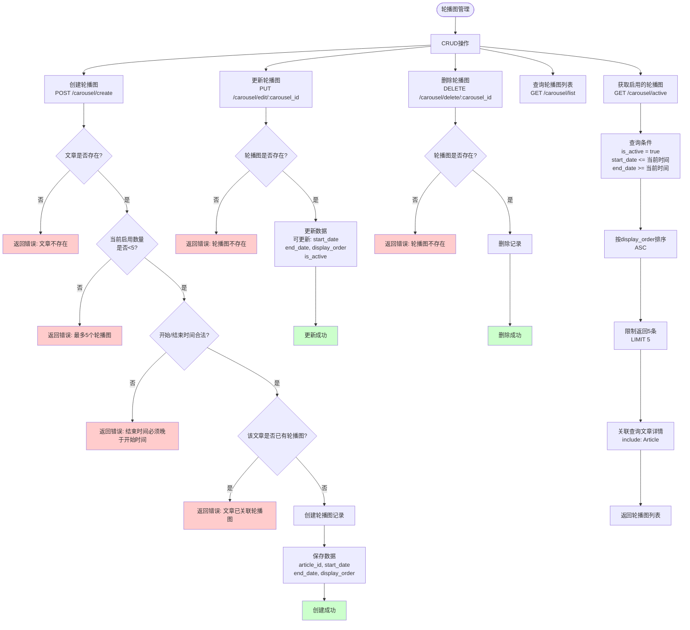

# NDES国防新闻管理系统 - 业务逻辑文档

## 目录
1. [系统概述](#系统概述)
2. [技术架构](#技术架构)
3. [核心业务流程](#核心业务流程)
4. [数据模型](#数据模型)
5. [API接口说明](#API接口说明)
6. [安全机制](#安全机制)

---

## 系统概述

**NDES（National Defense Editorial System）** 是一个国防新闻内容管理系统，提供文章发布、内容审核、敏感词过滤、定时发布等功能。

### 主要功能模块
- **文章管理**：创建、编辑、删除、查询、搜索
- **内容审核**：三级审核机制（本地敏感词 + 阿里云AI + 人工审核）
- **敏感词管理**：支持关键词和正则表达式两种过滤模式
- **分类管理**：支持多级分类树形结构
- **用户管理**：JWT认证、角色权限控制
- **版本控制**：文章编辑历史记录与版本回溯
- **定时发布**：支持预约发布时间
- **轮播图管理**：首页轮播图配置

---

## 技术架构

### 后端技术栈
```
Node.js + Express 4.16.1
├── ORM: Sequelize 6.37.7
├── 数据库: MySQL
├── 认证: JWT (jsonwebtoken + express-jwt)
├── 文件上传: multer 2.0.2
├── 敏感词: @node-rs/jieba (中文分词) + node-cache
├── AI审核: 阿里云内容安全 Green API
├── 定时任务: node-cron 4.2.1
└── 加密: bcrypt 6.0.0
```

### 项目结构
```
ndes-server/
├── app.js                    # 应用入口
├── bin/www                   # HTTP服务器启动
├── model/                    # Sequelize数据模型
│   ├── article.js           # 文章模型
│   ├── articleVersion.js    # 文章版本
│   ├── category.js          # 分类
│   ├── reviews.js           # 审核记录
│   ├── sensitiveWord.js     # 敏感词
│   ├── user.js              # 用户
│   ├── role.js              # 角色
│   ├── media.js             # 媒体文件
│   └── carousels.js         # 轮播图
├── routes/                   # 路由层
│   ├── article.js           # 文章API
│   ├── users.js             # 用户API
│   ├── categories.js        # 分类API
│   ├── reviews.js           # 审核API
│   ├── sensitiveWord.js     # 敏感词API
│   ├── articleVersion.js    # 版本API
│   └── carousels.js         # 轮播图API
└── utils/                    # 工具类
    ├── db.js                # 数据库连接
    ├── jwt.js               # JWT中间件
    ├── sensitive.js         # 敏感词引擎
    ├── ai-review.js         # 审核决策
    ├── aliyun-green.js      # 阿里云API
    ├── cronJob.js           # 定时任务
    └── upload.js            # 文件上传配置
```

---

## 核心业务流程

### 1. 文章创建与发布流程


**关键代码位置**：`routes/article.js:136-282`

**业务规则**：
1. **必填项验证**：标题、内容、分类ID不能为空
2. **敏感词检测**：使用Jieba分词 + 关键词/正则匹配
3. **三种发布模式**：
   - 草稿（`as=draft`）：直接保存，状态=草稿
   - 定时发布：设置`scheduled_publish_date`，状态=待发布
   - 立即提交：执行审核，状态=待审
4. **版本控制**：每次创建/编辑都生成新版本记录
5. **事务保证**：文章、版本、媒体文件要么全成功，要么全回滚

---

### 2. 文章编辑流程


**关键代码位置**：`routes/article.js:284-423`

**业务规则**：
1. **三种编辑操作**：
   - `action=save`：保存为草稿
   - `action=schedule`：设置定时发布
   - `action=submit`：提交审核
2. **版本递增**：每次编辑自动创建新版本（version_number++）
3. **媒体替换策略**：先删除所有旧媒体，再添加新媒体
4. **审核日志记录**：如果执行了审核，将审核结果写入reviews表

---

### 3. 内容审核流程（三级审核机制）


**关键代码位置**：
- 本地审核：`utils/sensitive.js:54-87` (filter函数)
- AI审核：`utils/aliyun-green.js:94-261` (scanText函数)
- 审核决策：`utils/ai-review.js:3-27` (performReview函数)
- 人工审核：`routes/reviews.js:7-46`

**审核规则**：

#### 第一级：本地敏感词检测
```javascript
// utils/sensitive.js
filter(text) {
  1. 使用Jieba进行中文分词
  2. 检查关键词缓存（wordCache）
  3. 执行正则表达式匹配（regexPatterns）
  4. 如果命中，返回 hitWords 列表
  5. 未命中则放行到下一级
}
```

#### 第二级：阿里云内容安全（当前未启用）
```javascript
// utils/aliyun-green.js
scanText(text) {
  1. 构造请求体（scenes: antispam, terrorism, porn）
  2. 计算Content-MD5签名
  3. 生成HMAC-SHA1签名（特殊格式：Content-Type出现两次）
  4. 发送HTTPS请求到阿里云
  5. 解析结果：
     - suggestion=block → 拒绝
     - suggestion=review → 人工审核
     - suggestion=pass → 通过
}
```

#### 第三级：人工审核
```javascript
// routes/reviews.js
POST /reviews/:article_id {
  审核结果: "通过" | "退回修改" | "拒绝"
  状态映射:
    通过 → 已发布（设置publish_date）
    退回修改 → 草稿
    拒绝 → 草稿
}
```

---

### 4. 定时发布流程


**关键代码位置**：`utils/cronJob.js:5-61`

**定时任务配置**：
```javascript
// app.js:24-25 启动定时任务
const cronJob = require('./utils/cronJob');
cronJob();

// Cron表达式: '*/1 * * * *'
// ┬ ─ 分钟 (每1分钟)
// │ ┬ ─ 小时 (每小时)
// │ │ ┬ ─ 日期 (每天)
// │ │ │ ┬ ─ 月份 (每月)
// │ │ │ │ ┬ ─ 星期 (每周)
// * * * * *
```

**业务规则**：
1. **执行频率**：每分钟检查一次
2. **时区处理**：将UTC时间转换为北京时间（UTC+8）进行比较
3. **并发控制**：使用行级锁（`LOCK.UPDATE`）防止重复发布
4. **批量处理**：使用`Promise.all`同时更新所有符合条件的文章
5. **事务保证**：发布操作要么全部成功，要么全部回滚

---

### 5. 敏感词管理流程


**关键代码位置**：`utils/sensitive.js`

**敏感词类型**：

#### 1. 关键词模式（keyword）
- 使用Jieba分词后精确匹配
- 存储在`node-cache`中，O(1)查询速度
- 适用场景：单个词汇（如"暴力"、"色情"）

```javascript
// 示例
{ word: "敏感词", type: "keyword" }
// 匹配逻辑：分词后包含"敏感词"即命中
```

#### 2. 正则表达式模式（regex）
- 支持复杂模式匹配
- 预编译为`RegExp`对象，提高执行效率
- 适用场景：模糊匹配（如电话号码、邮箱、特殊字符组合）

```javascript
// 示例
{ word: "\\d{11}", type: "regex" }
// 匹配逻辑：正则表达式匹配11位数字（手机号）
```

**缓存机制**：
```javascript
// 内存缓存结构
wordCache: {
  "敏感词1": 1,
  "敏感词2": 1,
  ...
}

regexPatterns: [
  { word: "\\d{11}", regex: /\d{11}/gi, replacement: "***" },
  { word: "[a-z0-9._%+-]+@[a-z0-9.-]+\\.[a-z]{2,}", regex: /[a-z0-9._%+-]+@.../gi, replacement: "***" },
  ...
]
```

**过滤算法**：
```javascript
function filter(text) {
  1. 先执行正则匹配（regexPatterns）
     - 记录命中词汇
     - 替换为 "***"

  2. 再执行关键词匹配（wordCache）
     - 对文本进行Jieba分词
     - 查找wordCache
     - 替换命中词为 "*" * 词长度

  3. 返回 { text: 替换后文本, hitWords: 命中词列表 }
}
```

---

### 6. 用户登录与认证流程


**关键代码位置**：
- 登录逻辑：`routes/users.js:115-153`
- JWT中间件：`utils/jwt.js`

**认证流程详解**：

#### 1. 登录处理
```javascript
// routes/users.js:115-153
POST /users/login
{
  username: "admin",
  password: "123456"
}

处理流程:
1. 查询用户（User.findOne）
2. 验证密码（明文比对，生产环境应使用bcrypt）
3. 生成JWT Token
   - payload: { id: user_id, role: role_id }
   - secret: 'suibian'（生产环境应使用环境变量）
   - expiresIn: '1h'
4. 返回用户信息 + Token
```

#### 2. JWT中间件
```javascript
// utils/jwt.js (推测实现)
const { expressjwt: jwt } = require('express-jwt');

module.exports = jwt({
  secret: 'suibian',
  algorithms: ['HS256']
}).unless({
  path: [
    '/users/login',     // 登录接口
    '/article/list',    // 公开接口
    '/article/searchAll',
    /^\/uploads\/.*/    // 静态资源
  ]
});

错误处理:
app.use((err, req, res, next) => {
  if (err.name === 'UnauthorizedError') {
    return res.status(401).json({ error: '无效的Token' });
  }
  next(err);
});
```

#### 3. 权限控制
```javascript
// 基于角色的权限控制（RBAC）
用户角色:
- role_id = 1: 管理员（超级权限）
- role_id = 2: 审核员（审核权限）
- role_id = 3: 作者（创建/编辑自己的文章）

权限检查示例:
if (req.auth.role !== 1) {
  return res.status(403).json({ error: '无权限执行此操作' });
}
```

---

### 7. 文章版本控制流程


**关键代码位置**：`routes/articleVersion.js`

**版本记录结构**：
```javascript
// model/articleVersion.js
ArticleVersion {
  version_id: 主键（自增）
  article_id: 文章ID（外键）
  version_number: 版本号（从1开始递增）
  title: 快照标题
  content: 快照内容
  editor: 编辑者
  created_at: 创建时间
}

// 查询示例
SELECT * FROM article_versions
WHERE article_id = 123
ORDER BY version_number DESC;

结果:
| version_number | title           | editor | created_at          |
|----------------|-----------------|--------|---------------------|
| 5              | 最新修改标题     | admin  | 2025-11-05 10:30:00 |
| 4              | 第四次修改       | editor1| 2025-11-04 15:20:00 |
| 3              | 第三次修改       | admin  | 2025-11-03 09:10:00 |
| 2              | 第二次修改       | admin  | 2025-11-02 14:00:00 |
| 1              | 初始版本         | admin  | 2025-11-01 10:00:00 |
```

**版本回溯规则**：
1. **状态重置**：回溯后文章状态自动变为"待审"，需要重新审核
2. **创建新版本**：回溯操作本身也会创建一个新版本记录
3. **内容快照**：版本表存储完整的title和content快照，不依赖主表

**应用场景**：
- 误操作恢复：编辑错误内容后恢复到之前的版本
- 对比功能：查看不同版本之间的差异
- 审计追踪：记录谁在什么时候修改了什么内容

---

### 8. 轮播图管理流程



**关键代码位置**：`routes/carousels.js`

**轮播图规则**：

#### 1. 数量限制
- 最多同时启用5个轮播图（`is_active=true`）
- 创建时验证当前启用数量
- 超过限制则返回错误

#### 2. 时间控制
```javascript
// 定时播放逻辑
start_date: 开始显示日期
end_date: 结束显示日期

前端查询: GET /carousel/active
后端过滤:
WHERE is_active = true
AND start_date <= NOW()
AND end_date >= NOW()
```

#### 3. 唯一性约束
- 每篇文章只能关联一个轮播图
- 数据库级别约束：`UNIQUE(article_id)`

#### 4. 排序控制
- `display_order`：轮播图显示顺序（数字越小越靠前）
- 前端查询时自动按`ORDER BY display_order ASC`排序

**数据模型**：
```javascript
// model/carousels.js
Carousel {
  carousel_id: 主键
  article_id: 文章ID（外键，唯一）
  start_date: 开始显示日期
  end_date: 结束显示日期
  display_order: 显示顺序（默认0）
  is_active: 是否启用（默认true）
  created_at: 创建时间
  updated_at: 更新时间
}

// 外键关联
Carousel.belongsTo(Article, { foreignKey: 'article_id' });
Article.hasOne(Carousel, { foreignKey: 'article_id' });
```

---

## 数据模型

### ER图（实体关系图）


### 关键表结构说明

#### 1. articles（文章表）
```sql
CREATE TABLE articles (
  article_id INT PRIMARY KEY AUTO_INCREMENT,
  title VARCHAR(255) NOT NULL,
  content TEXT NOT NULL,
  category_id INT NOT NULL,
  status ENUM('草稿', '待审', '待发布', '已发布') DEFAULT '草稿',
  scheduled_publish_date DATETIME NULL,  -- 定时发布时间
  publish_date DATETIME NULL,            -- 实际发布时间
  source VARCHAR(255),                   -- 来源
  editor VARCHAR(100),                   -- 编辑者
  created_at DATETIME DEFAULT CURRENT_TIMESTAMP,
  updated_at DATETIME DEFAULT CURRENT_TIMESTAMP ON UPDATE CURRENT_TIMESTAMP,
  FOREIGN KEY (category_id) REFERENCES categories(category_id),
  FULLTEXT INDEX ft_title_content (title, content)  -- 全文索引
) ENGINE=InnoDB DEFAULT CHARSET=utf8mb4;
```

#### 2. sensitive_words（敏感词表）
```sql
CREATE TABLE sensitive_words (
  id INT PRIMARY KEY AUTO_INCREMENT,
  word VARCHAR(255) NOT NULL UNIQUE,
  type ENUM('keyword', 'regex') DEFAULT 'keyword',
  created_at DATETIME DEFAULT CURRENT_TIMESTAMP
) ENGINE=InnoDB DEFAULT CHARSET=utf8mb4;
```

#### 3. article_versions（文章版本表）
```sql
CREATE TABLE article_versions (
  version_id INT PRIMARY KEY AUTO_INCREMENT,
  article_id INT NOT NULL,
  version_number INT NOT NULL,
  title VARCHAR(255) NOT NULL,
  content TEXT NOT NULL,
  editor VARCHAR(100),
  created_at DATETIME DEFAULT CURRENT_TIMESTAMP,
  FOREIGN KEY (article_id) REFERENCES articles(article_id) ON DELETE CASCADE,
  UNIQUE KEY uk_article_version (article_id, version_number)
) ENGINE=InnoDB DEFAULT CHARSET=utf8mb4;
```

---

## API接口说明

### 文章管理接口

#### 1. 创建文章
```http
POST /article/create?as=draft
Content-Type: multipart/form-data
Authorization: Bearer {token}

Body:
- title: 文章标题（必填）
- content: 文章内容（必填）
- category_id: 分类ID（必填）
- source: 来源（可选）
- editor: 编辑者（可选）
- scheduled_publish_date: 定时发布时间（可选）
- file: 媒体文件（可选，最多10个）

Query参数:
- as=draft: 保存为草稿
- as=submit: 提交审核（默认）

Response:
{
  "message": "草稿已保存 | 已提交，等待审核 | 已设置定时发布",
  "article": { article对象 },
  "uploadedMedia": [ media列表 ],
  "status": "草稿 | 待审 | 待发布",
  "scheduled_publish_date": "2025-11-10T10:00:00.000Z",
  "publish_date": null
}
```

#### 2. 编辑文章
```http
PUT /article/edit/:article_id
Content-Type: multipart/form-data
Authorization: Bearer {token}

Body:
- title: 新标题
- content: 新内容
- category_id: 新分类ID
- action: 操作类型（save|submit|schedule）
- scheduled_publish_date: 定时发布时间（action=schedule时必填）
- file: 新媒体文件（可选）

Response:
{
  "message": "草稿已保存 | 文章已提交，等待审核 | 文章已设置定时发布",
  "article": { 更新后的article对象 },
  "uploadedMedia": [ 新媒体列表 ]
}
```

#### 3. 按状态查询文章
```http
GET /article/status/:status?page=1&pageSize=10
Authorization: Bearer {token}

Path参数:
- status: 草稿 | 待审 | 已发布

Query参数:
- page: 页码（默认1）
- pageSize: 每页数量（默认10，最大50）

Response:
{
  "total": 100,
  "page": 1,
  "pageSize": 10,
  "list": [
    {
      "article_id": 1,
      "title": "文章标题",
      "content": "文章内容",
      "status": "已发布",
      "publish_date": "2025-11-05T10:00:00.000Z",
      "Category": {
        "category_id": 5,
        "category_name": "军事新闻",
        "ParentCategory": {
          "category_id": 1,
          "category_name": "新闻资讯"
        }
      },
      "Media": [
        {
          "media_id": 10,
          "media_type": "image",
          "media_url": "http://localhost:3000/uploads/1234567890.jpg",
          "description": "封面图"
        }
      ]
    }
  ]
}
```

#### 4. 全文搜索
```http
GET /article/searchAll?words=关键词&page=1&pageSize=10&status=published

Query参数:
- words: 搜索关键词（必填）
- page: 页码
- pageSize: 每页数量
- status: published（仅搜索已发布文章，可选）

Response:
{
  "total": 5,
  "page": 1,
  "pageSize": 10,
  "keyword": "关键词",
  "sensitive_hit": false,
  "list": [
    {
      "article_id": 1,
      "title": "文章<mark>关键词</mark>标题",  // 高亮显示
      "content": "文章内容包含<mark>关键词</mark>...",
      "publish_date": "2025-11-05T10:00:00.000Z",
      "score": 2.0  // 相关性评分
    }
  ]
}
```

### 审核接口

#### 1. 提交审核
```http
POST /reviews/:article_id
Content-Type: application/json
Authorization: Bearer {token}

Body:
{
  "reviewer": "admin",
  "review_result": "通过",  // 通过 | 退回修改 | 拒绝
  "review_comments": "审核意见"
}

Response:
{
  "message": "审核完成",
  "review_result": "通过",
  "newStatus": "已发布"
}
```

#### 2. 查询审核记录
```http
GET /reviews/query/:article_id
Authorization: Bearer {token}

Response:
[
  {
    "review_id": 1,
    "article_id": 123,
    "reviewer": "admin",
    "review_result": "通过",
    "review_comments": "内容符合规范",
    "review_time": "2025-11-05T10:30:00.000Z",
    "Reviewer": {
      "username": "admin"
    }
  }
]
```

### 敏感词接口

#### 1. 创建敏感词
```http
POST /sensitive/create
Content-Type: application/json
Authorization: Bearer {token}

Body:
{
  "word": "敏感词",
  "type": "keyword"  // keyword | regex
}

Response:
{
  "message": "敏感词添加成功"
}
```

#### 2. 搜索敏感词
```http
GET /sensitive/search?keyword=关键词&page=1&pageSize=10
Authorization: Bearer {token}

Response:
{
  "total": 10,
  "page": 1,
  "pageSize": 10,
  "list": [
    {
      "id": 1,
      "word": "敏感词",
      "type": "keyword",
      "created_at": "2025-11-01T10:00:00.000Z"
    }
  ]
}
```

### 用户接口

#### 1. 用户登录
```http
POST /users/login
Content-Type: application/json

Body:
{
  "username": "admin",
  "password": "123456"
}

Response:
{
  "userInfo": {
    "code": 1,
    "msg": "登录成功",
    "result": {
      "user_id": 1,
      "username": "admin",
      "email": "admin@example.com",
      "role_id": 1,
      "avatar_url": "http://localhost:3000/uploads/avatar.jpg",
      "token": "eyJhbGciOiJIUzI1NiIsInR5cCI6IkpXVCJ9..."
    }
  }
}
```

---

## 安全机制

### 1. 认证与授权
- **JWT Token认证**：有效期1小时
- **角色权限控制**：
  - 管理员（role_id=1）：所有权限
  - 审核员（role_id=2）：审核权限
  - 作者（role_id=3）：创建/编辑自己的文章

### 2. 内容安全
- **三级审核机制**：
  1. 本地敏感词过滤（Jieba分词）
  2. 阿里云内容安全API（预留接口）
  3. 人工审核
- **敏感词库**：支持关键词和正则表达式
- **实时缓存**：敏感词加载到内存，高效过滤

### 3. 数据安全
- **密码加密**：bcrypt加密（生产环境）
- **SQL注入防护**：Sequelize ORM参数化查询
- **事务保证**：关键操作使用数据库事务
- **文件上传限制**：类型限制、大小限制

### 4. API安全
- **CORS配置**：跨域请求控制
- **参数验证**：输入参数类型和范围验证
- **错误处理**：生产环境隐藏敏感错误信息

---

## 附录

### 环境变量配置
```bash
# .env文件
NODE_ENV=development
PORT=3000

# 数据库配置
DB_HOST=localhost
DB_PORT=3306
DB_NAME=ndes_db
DB_USER=root
DB_PASSWORD=your_password

# JWT配置
JWT_SECRET=suibian
JWT_EXPIRES_IN=1h

# 阿里云内容安全
ALIBABA_CLOUD_ACCESS_KEY_ID=your_access_key_id
ALIBABA_CLOUD_ACCESS_KEY_SECRET=your_access_key_secret
ALIBABA_CLOUD_BIZ_TYPE=default
```

### 数据库初始化
```bash
# 导入数据库结构
mysql -u root -p ndes_db < ndes_db.sql

# 同步数据模型（自动创建表）
npm start  # Sequelize会自动执行sequelize.sync()
```

### 启动命令
```bash
# 安装依赖
npm install

# 启动开发服务器
npm start

# 启动后台服务
node bin/www
```

---

**文档版本**：v1.0
**最后更新**：2025-11-05
**维护者**：NDES开发团队
